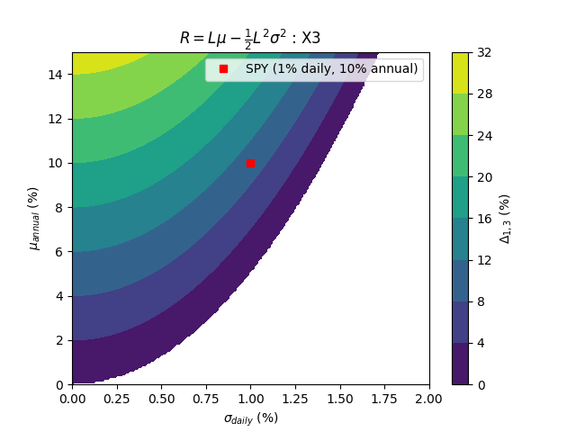
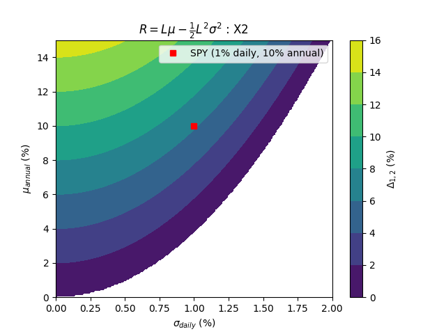

<link rel="stylesheet" href="https://cdn.jsdelivr.net/npm/katex/dist/katex.min.css">
<script defer src="https://cdn.jsdelivr.net/npm/katex/dist/katex.min.js"></script>
<script defer src="https://cdn.jsdelivr.net/npm/katex/dist/contrib/auto-render.min.js"
        onload="renderMathInElement(document.body);"></script>

# yolo

```
Alex Laut
Jan 15 25
```

Standard quantitative finance assumes that a portfolio’s net asset value changes follow a geometric Brownian motion (and thus are log-normally distributed) with arithmetic average return (or “drift”) $\mu$, standard deviation (or volatility) $\sigma$, and geometric average return $R$ given by

$$R = \mu-\sigma^2/2$$

A portfolio leveraged by $L$ will yield the following return

$$R_(L) = L\mu -L^2\sigma^2/2$$

The breakeven criterion below which an investment portfolio will suffer excessive losses due to leveraging the following inequality must be true


$$\boxed{\mu \geq \frac{\sigma^2}{2}\frac{L^2-1}{L-1}}$$

The following shows the advantage of leveraging a portfolio given it's annualized mean and daily volatility. In the example, and SPY fund returning approximately 10% annually with daily volatility of 1% still yields an advantage to an un-leveraged SPY fund of around 10%.



The breakeven criterion widens to more voltatile stocks by lowering the leverage to $L=2$, however the advantage to the SPY fund decreased to around 6%.

